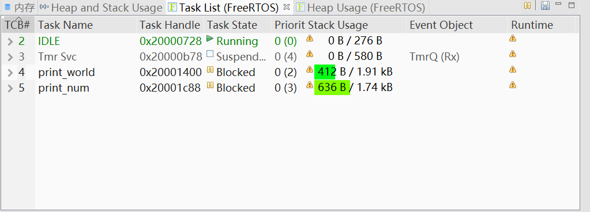

# FreeRtos学习笔记

## 第零章 FreRtos编码标准和风格

1. ### 命名规则

   1. 变量命名

      - uint32_t类型变量的前缀为ul，u表示无符号unsigned，l表示long

      - uint16_t类型变量的前缀为us，s表示short

      - uint8_t类型变量的前缀为uc，c表示char
      - 非stdint.h定义的前缀为x
      - 非stdint.h定义的无符号前缀为ux
      - size_t的前缀也为x
      - char类型前缀为c
      - 枚举变量前缀为e
      - 指针类型前缀前面要多加一个p

   2. 函数命名

      - 使用static限定的私有函数使用前缀prv
      - api函数使用其返回值来决定函数前缀，无返回值的为v，v为void

   3. 宏命名

      - 宏定义使用文件名的一部发，比如

   

## 第一章 hello world

首先在main.c同目录添加user.c/h，编译运行下

user.h

```c
/*
 * user.h
 *
 *  Created on: 2019年10月3日
 *      Author: 17616
 */
#ifndef USER_H_
#define USER_H_
#include"FreeRTOSConfig.h"
#include"FreeRTOS.h"
#include"task.h"
#include "fsl_debug_console.h"
#include "arm_math.h"
void UserMain(void);

#define START_TASK_PRIO 1
#define START_TASK_STK_SIZE 128
static TaskHandle_t start_task_handler;
void start_task(void* pvParameters);

#define PRINT_WORLD_PRIO 2
#define PRINT_WORLD_STK_SIZE 512
static  TaskHandle_t print_world_handler;
void print_world(void* pvParameters);

#define PRINT_NUM_PRIO 3
#define PRINT_NUM_STK_SIZE 512
static TaskHandle_t print_num_handler;
static float num = 10000.0f;
void print_num(void* pvParameters);

#endif /* USER_H_ */
```

user.c
```c
#include "user.h"

void UserMain(void)
{
	//创建开始任务
	xTaskCreate(start_task, "start_task", START_TASK_STK_SIZE, NULL, START_TASK_PRIO, &start_task_handler);
	//开始调度
	vTaskStartScheduler();
}

void start_task(void* pvParameters)
{
	//进入临界区
	taskENTER_CRITICAL();
	xTaskCreate(print_world, "print_world", PRINT_WORLD_STK_SIZE,NULL, PRINT_WORLD_PRIO, &print_world_handler);
	xTaskCreate(print_num, "print_num", PRINT_NUM_STK_SIZE,NULL, PRINT_NUM_PRIO, &print_num_handler);
	//退出临界区
	vTaskDelete(NULL);
	taskEXIT_CRITICAL();
}

void print_world(void* pvParameters)
{
	while (1)
	{
		PRINTF("Hello World\n");
		vTaskDelay(1000/portTICK_PERIOD_MS);
	}
}

void print_num(void* pvParameters)
{
	float num_b = num;
	while (1)
	{
		arm_sqrt_f32(num_b, &num);
		PRINTF("%f = sqrt( %f )\n", num, num_b);
		num_b = num;
		vTaskDelay(1000 / portTICK_PERIOD_MS);
	}
}

```

运行结果

```
Hello World
To Usermain()
100.000000 = sqrt( 10000.000000 )
Hello World
10.000000 = sqrt( 100.000000 )
Hello World
3.162278 = sqrt( 10.000000 )
Hello World
1.778279 = sqrt( 3.162278 )
Hello World
```

**注意一下栈的使用**



初始化时xTaskCreate参数的栈大小单位是字不是字节，32位单片机上一个字等于4B，要使用PRINTF的话保证栈大于1kb。如果爆栈就只有hardfault的下场。

## 第二章 FreeRtos配置

FreeRtos的配置、裁剪等是在source/FreeRTOSConfig.h用宏定义来完成的

以INCLUDE_开头用来配置函数的使能or启用

```c
/* Optional functions - most linkers will remove unused functions anyway. */
#define INCLUDE_vTaskPrioritySet                1//使能vTaskPrioritySet()
#define INCLUDE_uxTaskPriorityGet               1//同上
#define INCLUDE_vTaskDelete                     1//同上
#define INCLUDE_vTaskSuspend                    1//同上
#define INCLUDE_vTaskDelayUntil                 1//同上
#define INCLUDE_vTaskDelay                      1//同上
#define INCLUDE_xTaskGetSchedulerState          1//同上
#define INCLUDE_xTaskGetCurrentTaskHandle       1//同上
#define INCLUDE_uxTaskGetStackHighWaterMark     0//同上
#define INCLUDE_xTaskGetIdleTaskHandle          0//同上
#define INCLUDE_eTaskGetState                   0//同上
#define INCLUDE_xTimerPendFunctionCall          1//同上
#define INCLUDE_xTaskAbortDelay                 0//同上
#define INCLUDE_xTaskGetHandle                  0//同上
#define INCLUDE_xTaskResumeFromISR              1//同上
```

以config开头同理

```c
#define configUSE_PREEMPTION                    1//使能抢占式调度器，为1时会使用
#define configUSE_TICKLESS_IDLE                 0
#define configCPU_CLOCK_HZ                      (SystemCoreClock)
#define configTICK_RATE_HZ                      ((TickType_t)1000)
#define configMAX_PRIORITIES                    32//设置最大优先级数量，最优先级为configMAX_PRIORITIES-1
#define configMINIMAL_STACK_SIZE                ((unsigned short)100)//空闲任务最小堆栈大小
#define configMAX_TASK_NAME_LEN                 20//任务名最大长度
#define configUSE_16_BIT_TICKS                  0
#define configIDLE_SHOULD_YIELD                 0//使能空闲任务为同优先级任务让出cpu建议关闭
#define configUSE_TASK_NOTIFICATIONS            1//启用任务通知
#define configUSE_MUTEXES                       1//使能互斥信号量
#define configUSE_RECURSIVE_MUTEXES             1//使能递归互斥信号量
#define configUSE_COUNTING_SEMAPHORES           1//使能计数信号量
#define configUSE_ALTERNATIVE_API               0 /* Deprecated! */
#define configQUEUE_REGISTRY_SIZE               8
#define configUSE_QUEUE_SETS                    0
#define configUSE_TIME_SLICING                  0//使能同优先级任务按时间轮片调度
#define configUSE_NEWLIB_REENTRANT              0
#define configENABLE_BACKWARD_COMPATIBILITY     0//使能变量类型适应老版freertosv8以前代码
#define configNUM_THREAD_LOCAL_STORAGE_POINTERS 5
#define configUSE_APPLICATION_TASK_TAG          0
//定义使用什么方法来选择下一个要运行的任务，0为通用软件方法，1为快速硬件方法
#define configUSE_PORT_OPTIMISED_TASK_SELECTION 1//使用硬件方法计算前导零
/* Memory allocation related definitions. */
#define configSUPPORT_STATIC_ALLOCATION         0//使能静态分配内核对象
#define configSUPPORT_DYNAMIC_ALLOCATION        1
#define configTOTAL_HEAP_SIZE                   ((size_t)(10240))//堆大小
#define configAPPLICATION_ALLOCATED_HEAP        0//0为编译器分配堆，1为用户设置

/* Hook function related definitions. */
#define configUSE_IDLE_HOOK                     0
#define configUSE_TICK_HOOK                     0

//非0时使能堆栈溢出检测，使能时需要定义钩子函数void vApplicationStackOverflowHook(TaskHandle_t xTask, char* pcTaskName);
//1时启用检测方法1
//2时启用检测方法2
#define configCHECK_FOR_STACK_OVERFLOW          0
#define configUSE_MALLOC_FAILED_HOOK            0
#define configUSE_DAEMON_TASK_STARTUP_HOOK      0

/* Run time and task stats gathering related definitions. */
#define configGENERATE_RUN_TIME_STATS           0//使能时间统计功能，1时还需要定义portCONFIGURE_TIMER_FOR_RUN_TIME_STATS()初始化基准时钟，portGET_RUN_TIME_COUNTER_VALUE()获取时钟值
#define configUSE_TRACE_FACILITY                1//使能可视化追踪
#define configUSE_STATS_FORMATTING_FUNCTIONS    0//启用vTaskList()和vTaskGetRunTimeStats

/* Co-routine related definitions. */
#define configUSE_CO_ROUTINES                   0//使能携程
#define configMAX_CO_ROUTINE_PRIORITIES         2

/* Software timer related definitions. */
#define configUSE_TIMERS                        1
#define configTIMER_TASK_PRIORITY               (configMAX_PRIORITIES - 1)
#define configTIMER_QUEUE_LENGTH                20//软件定时器的最大命令长度
#define configTIMER_TASK_STACK_DEPTH            (configMINIMAL_STACK_SIZE * 2)

/* Define to trap errors during development. */
#define configASSERT(x) if((x) == 0) {taskDISABLE_INTERRUPTS(); for (;;);}//设置ASSERT

```

## 第三章 任务调度api

> ```c
> BaseType_t xTaskCreate(	TaskFunction_t pxTaskCode,//任务函数
> 						const char * const pcName,//任务名
> 						const configSTACK_DEPTH_TYPE usStackDepth,//栈大小
> 						void * const pvParameters,//传递给任务函数的参数
> 						UBaseType_t uxPriority,//优先级 0为最低
> 						TaskHandle_t * const pxCreatedTask )//任务句柄
> ```
>
> 创建任务返回pdPASS为创建成功

> ```c
> void vTaskDelete( TaskHandle_t pxTask );
> ```
>
> 删除任务，删除任务之后其内存会由空闲任务回收，参数为NULL是是删除自己

## 第四章 中断配置和临界区

回到source/FreeRTOSConfig.h

```c
#define configPRIO_BITS 4 /* 15 priority levels */
```

这里定义k66使用多少位表达中断优先级，这里需要查k66手册得知，说明k66支持16级中断优先级

```c
#define configLIBRARY_MAX_SYSCALL_INTERRUPT_PRIORITY 5//小于不包含5时不归freertos管理
```

定义归rtos管理的最高优先级，高于这个优先级但不包括（也就是<5）不能使用rtos的api

> **临界区**指的是一个访问共用资源（例如：共用设备或是共用存储器）的程序片段，而这些共用资源又无法同时被多个[线程](https://baike.baidu.com/item/线程/103101)访问的特性。当有线程进入临界区段时，其他线程或是[进程](https://baike.baidu.com/item/进程/382503)必须等待（例如：bounded waiting 等待法），有一些同步的机制必须在临界区段的进入点与离开点实现，以确保这些共用资源是被互斥获得使用

rtos在进入临界区会屏蔽优先级configLIBRARY_MAX_SYSCALL_INTERRUPT_PRIORITY以下（包含）的中断，然后配置rtos内部的一些变量，所以高于这个优先级但不包括（也就是<5）的中断函数（指使用硬件中断的）不能使用rtos的api

临界区api

> ```c
> void taskENTER_CRITICAL( void );//进入临界区
> void taskEXIT_CRITICAL( void );//退出临界区
> ```

在中断函数（指使用硬件中断的）中使用临界区api

> ```c
> UBaseType_t taskENTER_CRITICAL_FROM_ISR( void );//该函数的返回值需要传递给下面这个函数
> void taskENTER_CRITICAL_FROM_ISR( UBaseType_t uxSavedInterruptStatus );//参数为上面那个函数的返回值
> ```

## 第五章 任务基础知识

任务状态，以下四种

1. 运行态Running

   > cpu正在执行。。。

2. 就绪态Ready

   > 任务准备好但是有更高优先级的任务在占用cpu

3. 阻塞态Blocked

   > 任务正在等待事件或者等待延时结束。一般有一个超时时间，超过时间之后会退出阻塞态，既是没有等待到事件 vTaskDelay()进入的等待时间等等

4. 挂起态Suspended

   > 挂起之后会暂停调度，进入和退出的函数是vTaskSuspend()和xTaskResume()实现

## 第六章 内核控制函数

```c
taskYIELD()//任务切换
taskENTER_CRITICAL()//进入临界区
taskEXIT_CRITICAL()//退出临界区
taskENTER_CRITICAL_FROM_ISR()//中断服务函数用
taskEXIT_CRITICAL_FROM_ISR()//中断服务函数用
taskDISABLE_INTERRUPTS()//关闭中断
taskENABLE_INTERRUPTS()//打开中断
vTaskStartScheduler()//开启任务调度
vTaskEndScheduler()//关闭任务调度
vTaskSuspendAll()//挂起任务调度器
xTaskResumeAll()//恢复任务调度器
vTaskStepTick()//设置系统节拍值
```

## 第七章 其他任务API函数

```c
void vTaskGetRunTimeStats( char *pcWriteBuffer );
void vTaskList( char * pcWriteBuffer );
```

这两函数输出的都是表格，缓存一定要大一点，前者获取的是任务的运行时间和占比，后者是每个任务的详细信息。需要设置相关的宏

## 第八章 时间管理（待）

## 第九章 FreeRtos队列（）

## 第十章 信号量（）

## 第十一章 软件定时器任务（）

## 第十二章 事件标志组（）

## 第十三章 任务通知·新（）

## 第十四章 低功耗模式（）

## 第十五章 空闲任务（）

## 第十六章 内存管理（）

