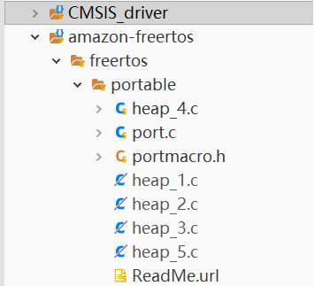

# FreeRtos学习笔记

## 第零章 FreRtos编码标准和风格

1. ### 命名规则

   1. 变量命名

      - uint32_t类型变量的前缀为ul，u表示无符号unsigned，l表示long

      - uint16_t类型变量的前缀为us，s表示short

      - uint8_t类型变量的前缀为uc，c表示char
      - 非stdint.h定义的前缀为x
      - 非stdint.h定义的无符号前缀为ux
      - size_t的前缀也为x
      - char类型前缀为c
      - 枚举变量前缀为e
      - 指针类型前缀前面要多加一个p

   2. 函数命名

      - 使用static限定的私有函数使用前缀prv
      - api函数使用其返回值来决定函数前缀，无返回值的为v，v为void

   3. 宏命名

      - 宏定义使用文件名的一部分，比如source/FreeRTOSConfig.h中的#define configGENERATE_RUN_TIME_STATS
      - 宏定义其他部分全用大写，并且单词之间使用下划线隔开

2. ### 数据类型

   只使用stdint.h和FreeRtos自己定义的数据类型下俩个例外
   
   1. char
   2. char*
   
   还有4个变量类型定义在文件portmacro.h中，属于移植要修改的
   
   1. TickType_t
   
      在32位单片机中必须定义为无符号的32位数据类型，在configUSE_16_BIT_TISCKS为0的时候定义为uint32_t
   
   2. BaseType_t 
   
      单片机效率最高的最大的数据类型，32位单片机就是int32_t
   
   3. UBaseType_t
   
      无符号的BaseType_t
   
   4. StackType_t
   
      堆栈使用的数据类型，在16位mcu上是16位的数据类型，在32位mcu上是32位的数据类型
   
   

## 第一章 hello world

首先在main.c同目录添加user.c/h，编译运行

user.h

```c
/*
 * user.h
 *
 *  Created on: 2019年10月3日
 *      Author: 17616
 */
#ifndef USER_H_
#define USER_H_
#include"FreeRTOSConfig.h"
#include"FreeRTOS.h"
#include"task.h"
#include "fsl_debug_console.h"
#include "arm_math.h"
void UserMain(void);

#define START_TASK_PRIO 1
#define START_TASK_STK_SIZE 128
static TaskHandle_t start_task_handler;
void start_task(void* pvParameters);

#define PRINT_WORLD_PRIO 2
#define PRINT_WORLD_STK_SIZE 512
static  TaskHandle_t print_world_handler;
void print_world(void* pvParameters);

#define PRINT_NUM_PRIO 3
#define PRINT_NUM_STK_SIZE 512
static TaskHandle_t print_num_handler;
static float num = 10000.0f;
void print_num(void* pvParameters);

#endif /* USER_H_ */
```

user.c
```c
#include "user.h"

void UserMain(void)
{
	//创建开始任务
	xTaskCreate(start_task, "start_task", START_TASK_STK_SIZE, NULL, START_TASK_PRIO, &start_task_handler);
	//开始调度
	vTaskStartScheduler();
}

void start_task(void* pvParameters)
{
	//进入临界区
	taskENTER_CRITICAL();
	xTaskCreate(print_world, "print_world", PRINT_WORLD_STK_SIZE,NULL, PRINT_WORLD_PRIO, &print_world_handler);
	xTaskCreate(print_num, "print_num", PRINT_NUM_STK_SIZE,NULL, PRINT_NUM_PRIO, &print_num_handler);
	//退出临界区
	vTaskDelete(NULL);
	taskEXIT_CRITICAL();
}

void print_world(void* pvParameters)
{
	while (1)
	{
		PRINTF("Hello World\n");
		vTaskDelay(1000/portTICK_PERIOD_MS);
	}
}

void print_num(void* pvParameters)
{
	float num_b = num;
	while (1)
	{
		arm_sqrt_f32(num_b, &num);
		PRINTF("%f = sqrt( %f )\n", num, num_b);
		num_b = num;
		vTaskDelay(1000 / portTICK_PERIOD_MS);
	}
}

```

运行结果

```
Hello World
To Usermain()
100.000000 = sqrt( 10000.000000 )
Hello World
10.000000 = sqrt( 100.000000 )
Hello World
3.162278 = sqrt( 10.000000 )
Hello World
1.778279 = sqrt( 3.162278 )
Hello World
```

**注意一下栈的使用**


初始化时xTaskCreate参数的栈大小单位是字不是字节，32位单片机上一个字等于4B，要使用PRINTF的话保证栈大于1kb。如果爆栈就只有hardfault的下场。

## 第二章 FreeRtos配置

FreeRtos的配置、裁剪等是在source/FreeRTOSConfig.h用宏定义来完成的

以INCLUDE_开头用来配置函数的使能or启用

```c
/* Optional functions - most linkers will remove unused functions anyway. */
#define INCLUDE_vTaskPrioritySet                1//使能vTaskPrioritySet()
#define INCLUDE_uxTaskPriorityGet               1//同上
#define INCLUDE_vTaskDelete                     1//同上
#define INCLUDE_vTaskSuspend                    1//同上
#define INCLUDE_vTaskDelayUntil                 1//同上
#define INCLUDE_vTaskDelay                      1//同上
#define INCLUDE_xTaskGetSchedulerState          1//同上
#define INCLUDE_xTaskGetCurrentTaskHandle       1//同上
#define INCLUDE_uxTaskGetStackHighWaterMark     0//同上
#define INCLUDE_xTaskGetIdleTaskHandle          0//同上
#define INCLUDE_eTaskGetState                   0//同上
#define INCLUDE_xTimerPendFunctionCall          1//同上
#define INCLUDE_xTaskAbortDelay                 0//同上
#define INCLUDE_xTaskGetHandle                  0//同上
#define INCLUDE_xTaskResumeFromISR              1//同上
```

以config开头同理

```c
#define configUSE_PREEMPTION                    1//使能抢占式调度器，为1时会使用
#define configUSE_TICKLESS_IDLE                 0
#define configCPU_CLOCK_HZ                      (SystemCoreClock)
#define configTICK_RATE_HZ                      ((TickType_t)1000)
#define configMAX_PRIORITIES                    32//设置最大优先级数量，最优先级为configMAX_PRIORITIES-1
#define configMINIMAL_STACK_SIZE                ((unsigned short)100)//空闲任务最小堆栈大小
#define configMAX_TASK_NAME_LEN                 20//任务名最大长度
#define configUSE_16_BIT_TICKS                  0
#define configIDLE_SHOULD_YIELD                 0//使能空闲任务为同优先级任务让出cpu建议关闭
#define configUSE_TASK_NOTIFICATIONS            1//启用任务通知
#define configUSE_MUTEXES                       1//使能互斥信号量
#define configUSE_RECURSIVE_MUTEXES             1//使能递归互斥信号量
#define configUSE_COUNTING_SEMAPHORES           1//使能计数信号量
#define configUSE_ALTERNATIVE_API               0 /* Deprecated! */
#define configQUEUE_REGISTRY_SIZE               8
#define configUSE_QUEUE_SETS                    0
#define configUSE_TIME_SLICING                  0//使能同优先级任务按时间轮片调度
#define configUSE_NEWLIB_REENTRANT              0
#define configENABLE_BACKWARD_COMPATIBILITY     0//使能变量类型适应老版freertosv8以前代码
#define configNUM_THREAD_LOCAL_STORAGE_POINTERS 5
#define configUSE_APPLICATION_TASK_TAG          0
//定义使用什么方法来选择下一个要运行的任务，0为通用软件方法，1为快速硬件方法
#define configUSE_PORT_OPTIMISED_TASK_SELECTION 1//使用硬件方法计算前导零
/* Memory allocation related definitions. */
#define configSUPPORT_STATIC_ALLOCATION         0//使能静态分配内核对象
#define configSUPPORT_DYNAMIC_ALLOCATION        1
#define configTOTAL_HEAP_SIZE                   ((size_t)(10240))//堆大小
#define configAPPLICATION_ALLOCATED_HEAP        0//0为编译器分配堆，1为用户设置

/* Hook function related definitions. */
#define configUSE_IDLE_HOOK                     0
#define configUSE_TICK_HOOK                     0

//非0时使能堆栈溢出检测，使能时需要定义钩子函数void vApplicationStackOverflowHook(TaskHandle_t xTask, char* pcTaskName);
//1时启用检测方法1
//2时启用检测方法2
#define configCHECK_FOR_STACK_OVERFLOW          0
#define configUSE_MALLOC_FAILED_HOOK            0
#define configUSE_DAEMON_TASK_STARTUP_HOOK      0

/* Run time and task stats gathering related definitions. */
#define configGENERATE_RUN_TIME_STATS           0//使能时间统计功能，1时还需要定义portCONFIGURE_TIMER_FOR_RUN_TIME_STATS()初始化基准时钟，portGET_RUN_TIME_COUNTER_VALUE()获取时钟值
#define configUSE_TRACE_FACILITY                1//使能可视化追踪
#define configUSE_STATS_FORMATTING_FUNCTIONS    0//启用vTaskList()和vTaskGetRunTimeStats

/* Co-routine related definitions. */
#define configUSE_CO_ROUTINES                   0//使能携程
#define configMAX_CO_ROUTINE_PRIORITIES         2

/* Software timer related definitions. */
#define configUSE_TIMERS                        1
#define configTIMER_TASK_PRIORITY               (configMAX_PRIORITIES - 1)
#define configTIMER_QUEUE_LENGTH                20//软件定时器的最大命令长度
#define configTIMER_TASK_STACK_DEPTH            (configMINIMAL_STACK_SIZE * 2)

/* Define to trap errors during development. */
#define configASSERT(x) if((x) == 0) {taskDISABLE_INTERRUPTS(); for (;;);}//设置ASSERT

```

## 第三章 任务调度api

> ```c
> BaseType_t xTaskCreate(	TaskFunction_t pxTaskCode,//任务函数
> 						const char * const pcName,//任务名
> 						const configSTACK_DEPTH_TYPE usStackDepth,//栈大小
> 						void * const pvParameters,//传递给任务函数的参数
> 						UBaseType_t uxPriority,//优先级 0为最低
> 						TaskHandle_t * const pxCreatedTask )//任务句柄
> ```
>
> 创建任务返回pdPASS为创建成功

> ```c
> void vTaskDelete( TaskHandle_t pxTask );
> ```
>
> 删除任务，删除任务之后其内存会由空闲任务回收，参数为NULL是是删除自己

## 第四章 中断配置和临界区

回到source/FreeRTOSConfig.h

```c
#define configPRIO_BITS 4 /* 15 priority levels */
```

这里定义k66使用多少位表达中断优先级，这里需要查k66手册得知，说明k66支持16级中断优先级

```c
#define configLIBRARY_MAX_SYSCALL_INTERRUPT_PRIORITY 5//小于不包含5时不归freertos管理
```

定义归rtos管理的最高优先级，高于这个优先级但不包括（也就是<5）不能使用rtos的api

> **临界区**指的是一个访问共用资源（例如：共用设备或是共用存储器）的程序片段，而这些共用资源又无法同时被多个[线程](https://baike.baidu.com/item/线程/103101)访问的特性。当有线程进入临界区段时，其他线程或是[进程](https://baike.baidu.com/item/进程/382503)必须等待（例如：bounded waiting 等待法），有一些同步的机制必须在临界区段的进入点与离开点实现，以确保这些共用资源是被互斥获得使用

rtos在进入临界区会屏蔽优先级configLIBRARY_MAX_SYSCALL_INTERRUPT_PRIORITY以下（包含）的中断，然后配置rtos内部的一些变量，所以高于这个优先级但不包括（也就是<5）的中断函数（指使用硬件中断的）不能使用rtos的api

临界区api

> ```c
> void taskENTER_CRITICAL( void );//进入临界区
> void taskEXIT_CRITICAL( void );//退出临界区
> ```

在中断函数（指使用硬件中断的）中使用临界区api

> ```c
> UBaseType_t taskENTER_CRITICAL_FROM_ISR( void );//该函数的返回值需要传递给下面这个函数
> void taskENTER_CRITICAL_FROM_ISR( UBaseType_t uxSavedInterruptStatus );//参数为上面那个函数的返回值
> ```

## 第五章 任务基础知识

任务状态，以下四种

1. 运行态Running

   > cpu正在执行。。。

2. 就绪态Ready

   > 任务准备好但是有更高优先级的任务在占用cpu

3. 阻塞态Blocked

   > 任务正在等待事件或者等待延时结束。一般有一个超时时间，超过时间之后会退出阻塞态，既是没有等待到事件 vTaskDelay()进入的等待时间等等

4. 挂起态Suspended

   > 挂起之后会暂停调度，进入和退出的函数是vTaskSuspend()和xTaskResume()实现

## 第六章 内核控制函数

```c
taskYIELD()//任务切换
taskENTER_CRITICAL()//进入临界区
taskEXIT_CRITICAL()//退出临界区
taskENTER_CRITICAL_FROM_ISR()//中断服务函数用
taskEXIT_CRITICAL_FROM_ISR()//中断服务函数用
taskDISABLE_INTERRUPTS()//关闭中断
taskENABLE_INTERRUPTS()//打开中断
vTaskStartScheduler()//开启任务调度
vTaskEndScheduler()//关闭任务调度
vTaskSuspendAll()//挂起任务调度器
xTaskResumeAll()//恢复任务调度器
vTaskStepTick()//设置系统节拍值
```

## 第七章 其他任务API函数

```c
void vTaskGetRunTimeStats( char *pcWriteBuffer );
void vTaskList( char * pcWriteBuffer );
```

这两函数输出的都是表格，缓存一定要大一点，前者获取的是任务的运行时间和占比，后者是每个任务的详细信息。需要设置相关的宏

## 第八章 时间管理（待）

## 第九章 FreeRtos队列

### 作用

1. 数据存储。队列为先进先出的数据结构
2. 多任务访问。任何任务都可以操作队列
3. **出队阻塞**。当任务从队列读取消息时，可以设置阻塞时间。
4. **入队阻塞**。当队列满时，可以阻塞。

### 创建

```c
#define xQueueCreate ( uxQueueLength, uxItemSize ) xQueueGenericCreate( ( uxQueueLength ), ( uxItemSize ), ( queueQUEUE_TYPE_BASE ) )
QueueHandle_t xQueueGenericCreate( const UBaseType_t uxQueueLength, const UBaseType_t uxItemSize, const uint8_t ucQueueType )
```

xQueueCreate是创建队列的函数，不过最终调用的是xQueueGenericCreate。第一个参数是队列的最大长度，第二个参数是每个项目的大小直接。第三个参数是类型，如果是创建队列的话为queueQUEUE_TYPE_BASE。

```c
#define queueQUEUE_TYPE_BASE				( ( uint8_t ) 0U )//普通消息队列
#define queueQUEUE_TYPE_SET					( ( uint8_t ) 0U )
#define queueQUEUE_TYPE_MUTEX 				( ( uint8_t ) 1U )//互斥信号量
#define queueQUEUE_TYPE_COUNTING_SEMAPHORE	( ( uint8_t ) 2U )//计数信号量
#define queueQUEUE_TYPE_BINARY_SEMAPHORE	( ( uint8_t ) 3U )//二值信号量
#define queueQUEUE_TYPE_RECURSIVE_MUTEX		( ( uint8_t ) 4U )//递归互斥信号量
```

返回队列的句柄

### 发送消息

| 分类           | 函数                | 描述                     |
| -------------- | ------------------- | ------------------------ |
| 任务级入队函数 | xQueueSend()        | 入队                     |
|                | xQueueSendToBack()  | 同上                     |
|                | xQueueSendToFront() | 前项入队                 |
|                | xQueueOverwrite()   | 带覆写功能入队           |
|                | xQueueGenericSend() | 上面都是调用这个真正干活 |
| 中断级         | xQueueSendFromISR() |                          |
| 不能设置阻塞时间 |   xQueueSendToBackFromISR()           |        |
| 并且可以需要在消息 | xQueueSendToFrontFromISR() |                          |
| 发送完成之后进行任务切换 | xQueueOverwriteFromISR() | |
| | xQueueGenericSendFromISR() | |

```c
BaseType_t xQueueGenericSend( QueueHandle_t xQueue,//队列句柄
                             const void * const pvItemToQueue, //指向消息的指针，会复制消息
                             TickType_t xTicksToWait, //阻塞时间
                             const BaseType_t xCopyPosition );//入队方式
#define	queueSEND_TO_BACK		( ( BaseType_t ) 0 )
#define	queueSEND_TO_FRONT		( ( BaseType_t ) 1 )
#define queueOVERWRITE			( ( BaseType_t ) 2 )
    //返回pdTRUE发送成功
```

```c
BaseType_t xQueueGenericSendFromISR( QueueHandle_t xQueue, 
                                    const void * const pvItemToQueue, 
                                    BaseType_t * const pxHigherPriorityTaskWoken, //标记退出之后是否需要任务切换 为pdTRU时，需要进行切换
                                    const BaseType_t xCopyPosition );
//对于第三个参数来说，有个函数方便的完成了ifelse的判断，可以使用宏定义portYIELD_FROM_ISR()完成切换
#define portEND_SWITCHING_ISR( xSwitchRequired ) if( xSwitchRequired != pdFALSE ) portYIELD()
#define portYIELD_FROM_ISR( x ) portEND_SWITCHING_ISR( x )
```

### 读取消息

| 任务级出队 | xQueueReceive()        | 完成之后删除   |
| ---------- | ---------------------- | -------------- |
|            | xQueuePeek()           | 完成之后不删除 |
| 中断级出队 | xQueueReceiveFromISR() |                |
|            | xQueuePeekFromISR()    |                |

```c
BaseType_t xQueueReceive( QueueHandle_t xQueue, void * const pvBuffer, TickType_t xTicksToWait );
BaseType_t xQueuePeek( QueueHandle_t xQueue, void * const pvBuffer, TickType_t xTicksToWait );
BaseType_t xQueueReceiveFromISR( QueueHandle_t xQueue, void * const pvBuffer, BaseType_t * const pxHigherPriorityTaskWoken );
BaseType_t xQueuePeekFromISR( QueueHandle_t xQueue, void * const pvBuffer );
//返回pdTRUE成功
```

示例

```c
#define QUEUE_SEND_PRIO 0
#define QUEUE_SEND_STK_SIZE 400
static TaskHandle_t queue_send_handler;
void queue_send(void* pvParameters);
static QueueHandle_t queue0;
#define QUEUE_RECEIVE_PRIO QUEUE_SEND_PRIO+1
#define QUEUE_RECEIVE_STK_SIZE 400
static TaskHandle_t queue_receive_handler;
void queue_receive(void* pvParameters);

void queue_send(void* pvParameters)
{
	PRINTF("0123 to on 4567 to off\n");
	char q;
	int result;
	while (1)
	{
		q=GETCHAR();
		result=xQueueSend(queue0, &q, portMAX_DELAY);//一直等待发送
	}
}

void queue_receive(void* pvParameters)
{
	char q;
	int result;
	while (1)
	{
		result=xQueueReceive(queue0, &q, portMAX_DELAY);//一直阻塞等待消息
		if (q=='0'){GPIO_PinWrite(LED1_GPIO, LED1_PIN, 0); PRINTF("LED1 on\n");}
		else if (q == '1') { GPIO_PinWrite(LED2_GPIO, LED2_PIN, 0); PRINTF("LED1 on\n"); }
		else if (q == '2') { GPIO_PinWrite(LED3_GPIO, LED3_PIN, 0); PRINTF("LED2 on\n"); }
		else if (q == '3') { GPIO_PinWrite(LED4_GPIO, LED4_PIN, 0); PRINTF("LED3 on\n"); }
		else if (q == '4') { GPIO_PinWrite(LED1_GPIO, LED1_PIN, 1); PRINTF("LED4 off\n"); }
		else if (q == '5') { GPIO_PinWrite(LED2_GPIO, LED2_PIN, 1); PRINTF("LED2 off\n"); }
		else if (q == '6') { GPIO_PinWrite(LED3_GPIO, LED3_PIN, 1); PRINTF("LED3 off\n"); }
		else if (q == '7') { GPIO_PinWrite(LED4_GPIO, LED4_PIN, 1); PRINTF("LED4 off\n"); }
	}
}
```


## 第十章 信号量

信号量一般用来任务同步、资源管理。freertos的信号量是包装之后的队列。

### 10.1 二值信号量（锁）

二值信号量会发生优先级翻转

#### 创建

xSemaphoreCreateBinary()创建之后默认没有释放是不能获取的

```c
#define xSemaphoreCreateBinary() xQueueGenericCreate( ( UBaseType_t ) 1, semSEMAPHORE_QUEUE_ITEM_LENGTH, queueQUEUE_TYPE_BINARY_SEMAPHORE )
```

#### 释放

xSemaphoreGive()和xSemaphoreGiveFromISR()

```c
#define xSemaphoreGive( xSemaphore )		xQueueGenericSend( ( QueueHandle_t ) ( xSemaphore ), NULL, semGIVE_BLOCK_TIME, queueSEND_TO_BACK )
#define xSemaphoreGiveFromISR( xSemaphore, pxHigherPriorityTaskWoken )	xQueueGiveFromISR( ( QueueHandle_t ) ( xSemaphore ), ( pxHigherPriorityTaskWoken ) )//不能用于互斥信号量

```

#### 获取

注意刚创建的信号量是获取不了的

```c
#define xSemaphoreTakeFromISR( xSemaphore, pxHigherPriorityTaskWoken )	xQueueReceiveFromISR( ( QueueHandle_t ) ( xSemaphore ), NULL, ( pxHigherPriorityTaskWoken ) )
#define xSemaphoreTake( xSemaphore, xBlockTime )		xQueueSemaphoreTake( ( xSemaphore ), ( xBlockTime ) )//不能用于互斥信号量
```


### 10.2 计数信号量

如果说二值信号量是长度为1的队列，那计数信号量就是长多大于1的队列。一般用于资源管理，比如管理停车场的停车位，很形象吧

```c
//创建
#define xSemaphoreCreateCounting( uxMaxCount, uxInitialCount ) xQueueCreateCountingSemaphore( ( uxMaxCount ), ( uxInitialCount ) )//需要设置最大计数值
//释放和获取同二值信号量
```

### 10.3 互斥信号量

互斥信号量是有优先级继承的二值信号量。当低优先级的任务先获取了信号量，然后高优先级再去获取信号量是，会将该低优先级的任务升级到改高优先级任务的优先级。互斥信号量，降低了高优先级任务的阻塞时间，尽量避免优先级翻转。

注意，不能在中断服务函数中使用互斥信号量

```c
//创建之后hui固定释放一次信号量
#define xSemaphoreCreateMutex() xQueueCreateMutex( queueQUEUE_TYPE_MUTEX )
//释放和获取同二值信号量
```

### 10.4 递归互斥信号量

特殊的互斥信号量。当一个任务获取了信号量之后，还能在同一个任务再次获取，并且获取了多少次就要释放多少次。同样有优先级继承的特性

```c
//创建之后会固定释放一次信号量
#define xSemaphoreCreateRecursiveMutex() xQueueCreateMutex( queueQUEUE_TYPE_RECURSIVE_MUTEX )
//释放
#define xSemaphoreGiveRecursive( xMutex )	xQueueGiveMutexRecursive( ( xMutex ) )
//获取
#define xSemaphoreTakeRecursive( xMutex, xBlockTime )	xQueueTakeMutexRecursive( ( xMutex ), ( xBlockTime ) )
```


## 第十一章 软件定时器任务

用于创建定时执行的任务

- 创建

  xTimerCreate

  ```c
  TimerHandle_t xTimerCreate(	const char * const pcTimerName,	//定时器名字
  								const TickType_t xTimerPeriodInTicks,//定时器周期，单位是节拍数
  								const UBaseType_t uxAutoReload,//单次定时器or周期定时器
  								void * const pvTimerID,//定时器编号，也可以用来传参区分同回调函数的不同的定时器
  								TimerCallbackFunction_t pxCallbackFunction )；//定时时间到执行的回调函数
  typedef void (*TimerCallbackFunction_t)( TimerHandle_t xTimer );
  ```

- 开启和复位

  ```c
  #define xTimerStart( xTimer, xTicksToWait ) xTimerGenericCommand( ( xTimer ), tmrCOMMAND_START, ( xTaskGetTickCount() ), NULL, ( xTicksToWait ) )//第二个参数是阻塞时间，因为涉及到队列操作
  #define xTimerStartFromISR( xTimer, pxHigherPriorityTaskWoken ) xTimerGenericCommand( ( xTimer ), tmrCOMMAND_START_FROM_ISR, ( xTaskGetTickCountFromISR() ), ( pxHigherPriorityTaskWoken ), 0U )
  //如果定时器已经在运行了，那么上面的效果和下面的一样
  #define xTimerReset( xTimer, xTicksToWait ) xTimerGenericCommand( ( xTimer ), tmrCOMMAND_RESET, ( xTaskGetTickCount() ), NULL, ( xTicksToWait ) )
  #define xTimerResetFromISR( xTimer, pxHigherPriorityTaskWoken ) xTimerGenericCommand( ( xTimer ), tmrCOMMAND_RESET_FROM_ISR, ( xTaskGetTickCountFromISR() ), ( pxHigherPriorityTaskWoken ), 0U )
  
  ```

- 停止和删除

  ```c
  #define xTimerStop( xTimer, xTicksToWait ) xTimerGenericCommand( ( xTimer ), tmrCOMMAND_STOP, 0U, NULL, ( xTicksToWait ) )
  #define xTimerStopFromISR( xTimer, pxHigherPriorityTaskWoken ) xTimerGenericCommand( ( xTimer ), tmrCOMMAND_STOP_FROM_ISR, 0, ( pxHigherPriorityTaskWoken ), 0U )
  #define xTimerDelete( xTimer, xTicksToWait ) xTimerGenericCommand( ( xTimer ), tmrCOMMAND_DELETE, 0U, NULL, ( xTicksToWait ) )
  
  ```

## 第十二章 事件标志组（）

## 第十三章 任务通知

### 发送通知

发送通知不会阻塞

| 函数                       | 描述                                                         |
| -------------------------- | ------------------------------------------------------------ |
| xTaskNotify                | 发送通知，带有通知值而且不保留接收任务原通知值               |
| xTaskNotifyFromISR         |                                                              |
| xTaskNotifyGive            | 发送通知，不带有通知值而且不保留接收任务原通知值，会将接收任务通知值+1 |
| vTaskNotifyGiveFromISR     |                                                              |
| xTaskNotifyAndQuery        | 发送通知，带有通知值而且保留接收任务原通知值                 |
| xTaskNotifyAndQueryFromISR |                                                              |

### 获取通知

通常有阻塞

| 函数             | 描述                                                         |
| ---------------- | ------------------------------------------------------------ |
| ulTaskNotifyTake | 获取任务通知，可以设置退出时将任务通知值清0或-1。当用作二值、计数信号量时，用来获取信号量 |
| xTaskNotifyWait  | 全功能获取任务通知                                           |


## 第十四章 低功耗Tickless模式（）

见k66例程

## 第十五章 空闲任务（）

## 第十六章 内存管理

FreeRtos内置了5中内存管理方法



### heap_1.c

内存堆为ucHeap[]，其内存分配方法不适用于动态内存。内存分配方法简单，但是无内存释放方法。

### heap_2.c

内存堆为ucHeap[]，内存分配方法简单，内存释放方法也简单。容易造成内存碎片

### heap_3.c

对c中的malloc()和free()的简单封装

### heap_4.c

内存堆为ucHeap[]，方法复杂，不造成内存碎片

### heap_5.c

同heap_4.c，只不过内存堆由用户提供，并且支持内存堆使用不连续的内存块。

在使用freertos API之前一定要先使用void vPortDefineHeapRegions( const HeapRegion_t * const pxHeapRegions )初始化内存堆。

```c
typedef struct HeapRegion
{
	uint8_t *pucStartAddress;
	size_t xSizeInBytes;
} HeapRegion_t;
HeapRegion_t xHeapRegions[]=
{
    {(uint8_t*)0x10000000UL,0x10000},
    {(uint8_t*)0x20000000UL,0x30000},
    {(uint8_t*)0xC0000000UL,0x2000000},
    {NULL,0}//结尾格式，成员按地址从低到高的岁序排列
}
vPortDefineHeapRegions(xHeapRegions);//初始化内存堆
```


